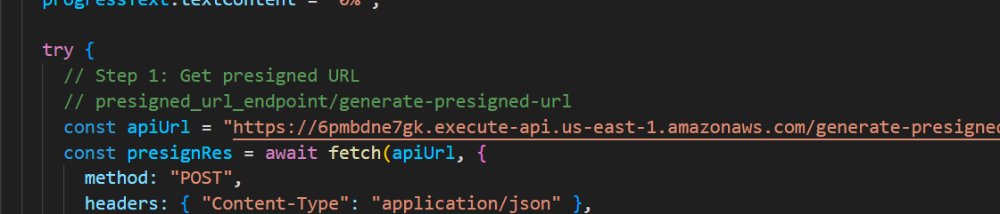
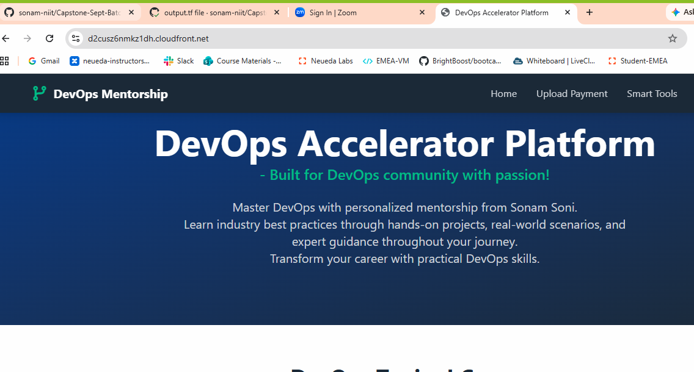
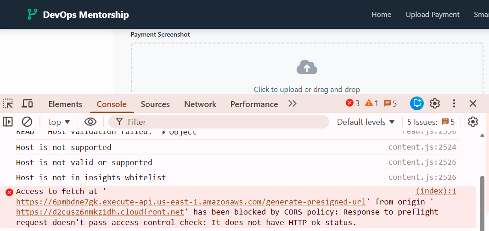
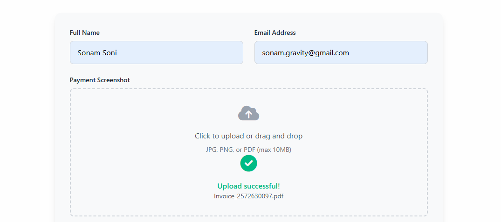

# Project Implementation

- clone my repository: https://github.com/sonam-niit/Capstone-Sept-Batch-2025.git
- or else follow below steps:

1. create folder named frontend:
    - inside create index.html
    - add shown code here
2. create folder called backed:
    - create folder generate-presigned-url
        + main.py (add code)
    - create folder process-uploaded-file
        + main.py (add code)

## Bucket Details

- here we need 3 buckets

1. S3 Remote Backend (create manually)
2. for uploading files (create using terraform)
3. for frontend hosting (create using terraform)

- create bucket run below commands in terminal

```bash
aws s3api create-bucket \
--bucket devops-accelerator-platform-tf-state-sonam \
--region us-east-1
```

- create DynamoDB table for Locking
- remote state locking

```bash
aws dynamodb create-table \
--table-name devops-accelerator-tf-locker \
--attribute-definitions AttributeName=LockID,AttributeType=S \
--key-schema AttributeName=LockID,KeyType=HASH \
--billing-mode PAY_PER_REQUEST \
--region us-east-1
```

- create Code for the same

1. add all resources for Infra
    - variables.tf
    - main.tf
    - terraform.tfvars
    - outputs.tf

2. also include all workflows
    - frontend.yml
    - backend-deploy.yml
    - terraform.yml

3. create zip file for Lambda functions

```bash
cd backend/generate-presigned-url
zip -r lambda.zip .
cd ..
cd process-uploaded-file
zip -r lambda.zip .
```

4. Push entire stuff on Github
- check AWS creates resources or not
- check terraform actions in workflows

5. check outputs and see presigned URL
- copy URL and edit HTML code in index.html



6. go s3 bucket open frontend bucket and upload this index.html there

- you can see now Cloufront link in browser
- you can default HTML page in browser



- try to fillup the form and submit details
- if you are getting below error



- Go to your Backend S3 Bucket
- permission - CORS -> edit

```json
[
    {
        "AllowedHeaders": [
            "*"
        ],
        "AllowedMethods": [
            "PUT",
            "POST",
            "DELETE",
            "GET",
            "HEAD"
        ],
        "AllowedOrigins": [
            "*"
        ],
        "ExposeHeaders": []
    }
]
```

- save

- Still now allowing to upload then
- AWS Console - APIs 
- select throttling
- select default
- burst limit: 100 (sudden spike)
- rate limit: 200 (normal flow 200 req per second)
- save
- try again to upload



- once upload successfully
- check subscription email
- check cloudwatch logs
- check s3 bucket uploads

